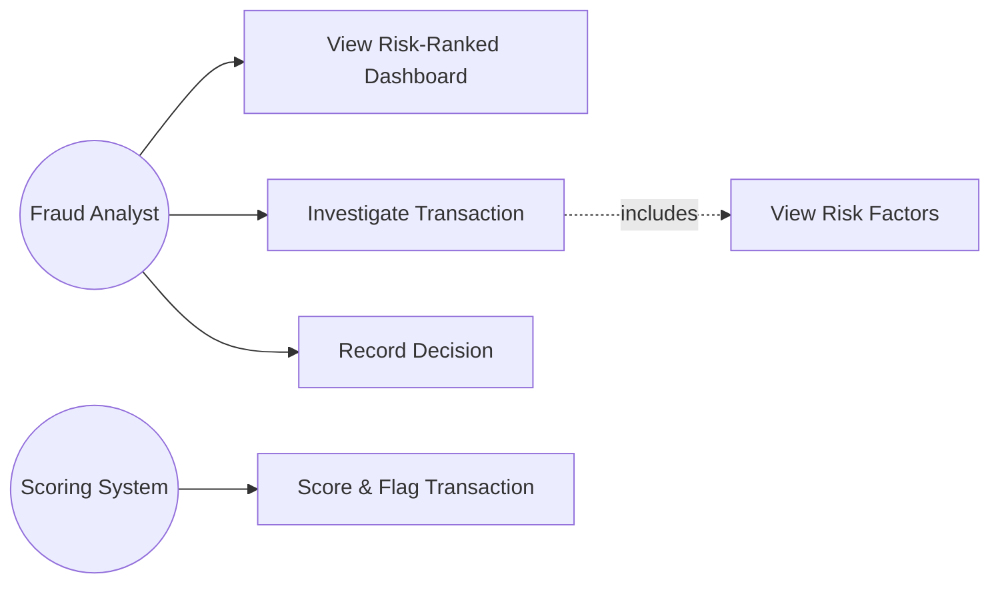
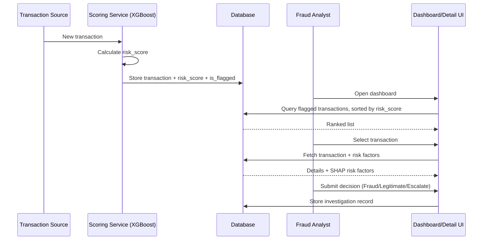
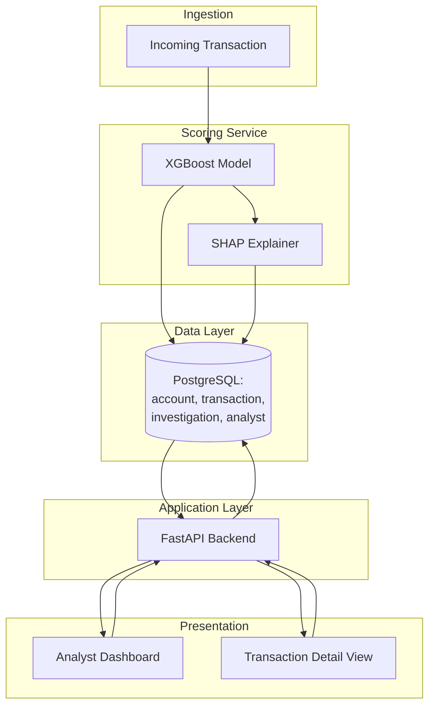

# AI-Powered Fraud Detection & Investigation Support System
### Project Documentation 

---

## Project Title

**"An AI-Powered Fraud Detection and Investigation Support System using Transaction-Level Machine Learning and Graph-Based Network Intelligence"**

---

## 2. Abstract (Draft)

Financial institutions process a high volume of transactions, a small fraction of which are fraudulent. Manual, transaction-by-transaction review by fraud analysts does not scale, and rule-based alerting systems tend to generate large numbers of false positives, increasing analyst workload without improving detection quality.

This project proposes a fraud detection and investigation support system in which a machine learning model (XGBoost) performs automated first-level risk scoring on incoming transactions. Transactions exceeding a configured risk threshold are flagged and surfaced to a Fraud Analyst through a risk-prioritized dashboard. The analyst reviews transaction details and the model's risk score, investigates further as needed, and records a final decision — Fraud, Legitimate, or Escalate. The system does not automate fraud decisions; it reduces analyst workload by performing the initial screening and prioritization that would otherwise be done manually.

The MVP is scoped to transaction-level detection only. A planned extension (Phase 2) introduces graph-based network intelligence via a Graph Neural Network (GNN) to detect coordinated, multi-account fraud patterns that transaction-level models cannot see in isolation.

---

## 3. Problem Statement

Fraud analysts at financial institutions are responsible for reviewing transactions flagged as potentially suspicious. As transaction volume grows, manual review becomes a bottleneck: analysts spend significant time on transactions that turn out to be legitimate, while genuinely high-risk transactions may not be reviewed promptly due to queue volume.

**The problem:** there is no automated first-level screening step that reliably prioritizes which transactions deserve an analyst's limited time, nor a consistent way to present the reasoning behind a risk flag so the analyst can investigate efficiently.

---

## 4. Objectives

1. Automatically calculate a fraud risk score for each incoming transaction using a trained ML model.
2. Flag transactions exceeding a configured risk threshold for analyst review.
3. Present flagged transactions to the analyst in a risk-ranked dashboard, so high-risk items are reviewed first.
4. Provide sufficient transaction detail and risk reasoning for the analyst to investigate without needing to query raw data separately.
5. Allow the analyst to record a final decision (Fraud / Legitimate / Escalate), keeping the analyst as the authoritative decision-maker.
6. Design the system architecture and database so that network-level fraud-ring detection (GNN) can be added in Phase 2 without redesigning the core system.

---

## 5. Scope

### In Scope — MVP 
- Transaction ingestion (batch or simulated stream) and risk scoring via XGBoost
- Threshold-based flagging
- Risk-ranked analyst dashboard
- Transaction detail view with risk score and top contributing risk factors
- Analyst decision recording (Fraud / Legitimate / Escalate)

### Phase 2 
- Account/transaction graph construction
- GNN-based network risk scoring (fraud-ring detection)
- Combined transaction + network risk score
- Connected-account view on the transaction detail screen

### Phase 3 
- Real-time streaming infrastructure (Kafka)
- Multi-analyst workload coordination (claim/ownership, SLA tracking)
- Feedback loop for model retraining from analyst decisions
- Management/reporting dashboards (fraud-dollar totals, model accuracy trends)

### Explicitly Out of Scope
- Real bank/UPI transaction data (regulatory restriction — public/synthetic datasets used instead, stated openly)
- Automated transaction blocking (system flags and informs; it never decides or acts on the analyst's behalf)

*Reviewer note:* Phase 3 items were present in earlier drafts (KPI strip, ownership chips, SLA aging) and have been deliberately excluded from the MVP — they solve coordination problems that don't exist for a single-analyst academic demo, and would consume build time without supporting FR-01–04.

---

## 6. Literature Survey

| System | Type | Relevant Technique | Gap / Difference from This Project |
|---|---|---|---|
| Stripe Radar | Production, proprietary | Large-scale ML scoring across network transaction data | Closed system; internals not inspectable or reusable for academic study |
| Feedzai | Enterprise platform | "WhiteBox Scoring" for explainable, regulator-facing risk scores | Closed-source, enterprise-only; validates that explainability is an industry-standard requirement, not an add-on |
| Typical academic/Kaggle fraud projects | Notebook-based | Binary classification on public datasets (e.g., ULB Credit Card Fraud) | Commonly report accuracy on an imbalanced dataset (misleading), stop at the notebook stage — no analyst-facing system, no explainability layer, no decision workflow |

**Identified gap this project addresses academically:** most public/academic fraud-detection work treats the task as a pure classification problem and stops at a trained model. This project treats it as an **analyst workflow support system** — scoring is only the first step; the deliverable is the decision-support loop around it (dashboard, explanation, decision recording), which is closer to how production systems like Feedzai are actually structured.

---

## 7. Tools & Technologies

| Layer | Choice | Reasoning |
|---|---|---|
| Transaction-level ML | XGBoost | Standard, well-documented, strong baseline for tabular imbalanced classification; fast to train and serve |
| Explainability | SHAP | Produces the top contributing factors needed for FR-03's risk reasoning, without requiring a separate model |
| Network intelligence (Phase 2) | PyTorch Geometric (GNN) | Only introduced when Phase 2 begins; not a Week 1–2 dependency |
| Backend/API | FastAPI | Lightweight, fast to build a scoring + dashboard-data endpoint; async-friendly for later real-time work |
| Database | PostgreSQL | Relational integrity for transactions/accounts/decisions; native support for future graph-adjacent queries (recursive CTEs) if Phase 2 needs lightweight graph features before a full GNN |
| Frontend | React (or Streamlit for faster MVP) | Dashboard + detail view are standard CRUD-style screens; no requirement demands a heavier framework |
| Deployment | Render / Railway (free tier) | Sufficient for an academic demo; no production-scale infra needed |

*Reviewer note:* No microservices, no Kafka, no Kubernetes in the MVP — none of the four locked requirements need them. If challenged in review: "the architecture is intentionally monolithic for the MVP because a single-service FastAPI app fully satisfies FR-01–04; distributed infrastructure would add operational complexity without functional benefit at this scale."

---

## 8. Software Requirements Specification (SRS)

### 8.1 Functional Requirements

**FR-01 — Transaction Risk Detection**
- Actor: System
- Trigger: New transaction received
- Flow: System extracts transaction features → XGBoost model calculates a risk score (0–1) → if score exceeds configured threshold, transaction is flagged
- Output: Transaction record updated with `risk_score`, `is_flagged`

**FR-02 — Risk-Prioritized Dashboard**
- Actor: Fraud Analyst
- Flow: Analyst opens dashboard → system queries flagged transactions → returns list sorted descending by `risk_score` → high-risk transactions (above a second, higher threshold) are visually highlighted
- Output: Ranked, highlighted list of open alerts

**FR-03 — Transaction Investigation**
- Actor: Fraud Analyst
- Flow: Analyst selects a flagged transaction → system returns transaction details, risk score, and top contributing risk factors (derived via SHAP on the XGBoost prediction)
- Output: Transaction detail view
- *Note: the risk-factor breakdown is included here because FR-04 (decision) is not meaningfully possible without it — an analyst cannot investigate a bare number.*

**FR-04 — Investigation Decision**
- Actor: Fraud Analyst
- Flow: Analyst reviews investigation → selects decision (Fraud / Legitimate / Escalate) → optionally adds a note → system records decision, analyst ID, and timestamp
- Output: Investigation record created; transaction status updated

### 8.2 Non-Functional Requirements

| ID | Requirement | Rationale |
|---|---|---|
| NFR-01 | Risk scoring must complete in under ~1 second per transaction | FR-01 must not create a backlog faster than it clears one; keeps the system usable for near-real-time ingestion |
| NFR-02 | Every flagged transaction must include a human-readable risk reason, not only a numeric score | Directly required to make FR-03 usable — an unexplained score is not investigable |
| NFR-03 | Risk score, threshold, and evaluation must use precision/recall/PR-AUC — never raw accuracy — as the reported metric | The dataset is highly imbalanced (fraud is a small minority class); accuracy is misleading and would misrepresent model quality |
| NFR-04 | System must record every analyst decision with a timestamp and analyst identity | Basic auditability — a fraud investigation record with no accountability trail is not realistic for this domain, even in an academic MVP |
| NFR-05 | Database schema must accommodate an `account_id`-linked transaction graph without restructuring existing tables | Enables Phase 2 (GNN) to be added additively, not as a redesign |

---

## 9. UML Diagrams

### 9.1 Use Case Diagram



### 9.2 Sequence Diagram — MVP End-to-End Flow


### 9.3 Class Diagram 


---

## 10. ER Diagram


---

## 11. Database Design

**Tables (PostgreSQL):**

```sql
CREATE EXTENSION IF NOT EXISTS pgcrypto;

-- ============ ACCOUNT ============
CREATE TABLE account (
    id              UUID PRIMARY KEY DEFAULT gen_random_uuid(),
    account_number  VARCHAR(34) NOT NULL UNIQUE,
    account_type    VARCHAR(20) NOT NULL CHECK (account_type IN ('personal','business')),
    status          VARCHAR(20) NOT NULL DEFAULT 'active' CHECK (status IN ('active','suspended','closed')),
    opened_at       TIMESTAMPTZ NOT NULL DEFAULT now(),
    created_at      TIMESTAMPTZ NOT NULL DEFAULT now()
);

-- ============ ANALYST ============
CREATE TABLE analyst (
    id          UUID PRIMARY KEY DEFAULT gen_random_uuid(),
    full_name   VARCHAR(120) NOT NULL,
    email       VARCHAR(160) NOT NULL UNIQUE,
    role        VARCHAR(30) NOT NULL DEFAULT 'fraud_analyst',
    is_active   BOOLEAN NOT NULL DEFAULT TRUE,
    created_at  TIMESTAMPTZ NOT NULL DEFAULT now()
);

-- ============ MODEL VERSION ============
CREATE TABLE model_version (
    id             UUID PRIMARY KEY DEFAULT gen_random_uuid(),
    model_name     VARCHAR(60) NOT NULL,
    version_label  VARCHAR(30) NOT NULL,
    algorithm      VARCHAR(40) NOT NULL DEFAULT 'xgboost',
    trained_at     TIMESTAMPTZ NOT NULL,
    status         VARCHAR(20) NOT NULL DEFAULT 'active' CHECK (status IN ('active','retired')),
    metrics        JSONB,
    created_at     TIMESTAMPTZ NOT NULL DEFAULT now(),
    UNIQUE (model_name, version_label)
);

-- ============ TRANSACTION ============
CREATE TABLE transaction (
    id                  UUID PRIMARY KEY DEFAULT gen_random_uuid(),
    sender_account_id   UUID NOT NULL REFERENCES account(id),
    receiver_account_id UUID NOT NULL REFERENCES account(id),
    amount              NUMERIC(18,2) NOT NULL CHECK (amount > 0),
    currency            CHAR(3) NOT NULL DEFAULT 'USD',
    transaction_type    VARCHAR(20) NOT NULL CHECK (transaction_type IN ('transfer','withdrawal','deposit','payment')),
    channel             VARCHAR(20) NOT NULL CHECK (channel IN ('online','atm','pos','mobile','branch')),
    merchant_name             VARCHAR(120),
    merchant_category_at_txn  VARCHAR(60),  -- snapshot, not authoritative merchant data; see Section 8a Fix #1
    device_fingerprint   VARCHAR(120),
    ip_address           INET,
    status               VARCHAR(20) NOT NULL DEFAULT 'completed' CHECK (status IN ('pending','completed','reversed')),
    occurred_at          TIMESTAMPTZ NOT NULL,
    created_at           TIMESTAMPTZ NOT NULL DEFAULT now(),
    CHECK (sender_account_id <> receiver_account_id)
);

CREATE INDEX idx_txn_sender   ON transaction(sender_account_id);
CREATE INDEX idx_txn_receiver ON transaction(receiver_account_id);
CREATE INDEX idx_txn_occurred ON transaction(occurred_at);

-- ============ RISK ASSESSMENT ============
CREATE TABLE risk_assessment (
    id                UUID PRIMARY KEY DEFAULT gen_random_uuid(),
    transaction_id    UUID NOT NULL REFERENCES transaction(id),
    model_version_id  UUID NOT NULL REFERENCES model_version(id),
    risk_probability  NUMERIC(6,5)  NOT NULL CHECK (risk_probability BETWEEN 0 AND 1),
    threshold_used    NUMERIC(6,5)  NOT NULL,
    risk_score        NUMERIC(5,2) GENERATED ALWAYS AS (risk_probability * 100) STORED
                          CHECK (risk_score BETWEEN 0 AND 100),
    is_flagged        BOOLEAN GENERATED ALWAYS AS (risk_probability >= threshold_used) STORED,
    shap_values       JSONB,
    top_features      JSONB,
    scored_at         TIMESTAMPTZ NOT NULL DEFAULT now()
);

CREATE INDEX idx_risk_txn_latest ON risk_assessment(transaction_id, scored_at DESC);
CREATE INDEX idx_risk_flagged_score ON risk_assessment(risk_score DESC) WHERE is_flagged;

-- ============ FRAUD ALERT ============
CREATE TABLE fraud_alert (
    id                  UUID PRIMARY KEY DEFAULT gen_random_uuid(),
    risk_assessment_id  UUID NOT NULL UNIQUE REFERENCES risk_assessment(id),
    status              VARCHAR(20) NOT NULL DEFAULT 'open' CHECK (status IN ('open','investigating','closed')),
    priority            VARCHAR(10) NOT NULL DEFAULT 'medium' CHECK (priority IN ('low','medium','high','critical')),
    created_at          TIMESTAMPTZ NOT NULL DEFAULT now(),
    closed_at           TIMESTAMPTZ
);

CREATE INDEX idx_alert_status_priority ON fraud_alert(status, priority DESC);

-- ============ INVESTIGATION ============
CREATE TABLE investigation (
    id                   UUID PRIMARY KEY DEFAULT gen_random_uuid(),
    fraud_alert_id       UUID NOT NULL REFERENCES fraud_alert(id),
    assigned_analyst_id  UUID NOT NULL REFERENCES analyst(id),
    status               VARCHAR(20) NOT NULL DEFAULT 'open' CHECK (status IN ('open','in_progress','closed','reopened')),
    opened_at            TIMESTAMPTZ NOT NULL DEFAULT now(),
    closed_at            TIMESTAMPTZ
);

CREATE INDEX idx_investigation_analyst ON investigation(assigned_analyst_id);
CREATE UNIQUE INDEX uq_one_open_investigation_per_alert
    ON investigation(fraud_alert_id)
    WHERE status IN ('open','in_progress');

-- ============ INVESTIGATION DECISION (append-only) ============
CREATE TABLE investigation_decision (
    id                  UUID PRIMARY KEY DEFAULT gen_random_uuid(),
    investigation_id    UUID NOT NULL REFERENCES investigation(id),
    analyst_id          UUID NOT NULL REFERENCES analyst(id),
    risk_assessment_id  UUID NOT NULL REFERENCES risk_assessment(id),
    decision            VARCHAR(20) NOT NULL CHECK (decision IN ('fraud','legitimate','escalate')),
    notes               TEXT,
    decided_at          TIMESTAMPTZ NOT NULL DEFAULT now()
);

CREATE INDEX idx_decision_investigation ON investigation_decision(investigation_id);
CREATE INDEX idx_decision_type ON investigation_decision(decision);

-- ============ AUDIT LOG ============
CREATE TABLE audit_log (
    id           UUID PRIMARY KEY DEFAULT gen_random_uuid(),
    actor_id     UUID,
    actor_type   VARCHAR(20) NOT NULL CHECK (actor_type IN ('analyst','system')),
    action       VARCHAR(50) NOT NULL,
    entity_type  VARCHAR(50) NOT NULL,
    entity_id    UUID NOT NULL,
    details      JSONB,
    created_at   TIMESTAMPTZ NOT NULL DEFAULT now()
);

CREATE INDEX idx_audit_entity ON audit_log(entity_type, entity_id);
```

**Design decisions:**
- `risk_reason` stored as text on `transaction` rather than a separate table — one score, one explanation, per transaction; no need for a join for something read every time the transaction is read (satisfies NFR-02 directly).
- `investigation` is separate from `transaction` (not just extra columns on it) because a transaction has exactly one score but should have an auditable decision record — this also cleanly supports NFR-04.
- No `graph_embedding` or `network_score` column added yet — deliberately withheld until Phase 2 is actually built, so the schema doesn't carry unused fields during Week 2 review.

---

## 12. System Architecture Diagram



**Phase 2 addition (shown for planning, not built now):**

```
Historical Transactions → Graph Builder → GNN → Account Embeddings → stored in DB
                                                        ↓
                                        Combined with XGBoost score at scoring time
```

*Reviewer note:* the architecture is intentionally a single FastAPI service, not split into microservices — every one of FR-01–04 is satisfied by one application talking to one database. Splitting this into separate services now would be solving a scaling problem this academic project doesn't have.

---


---
